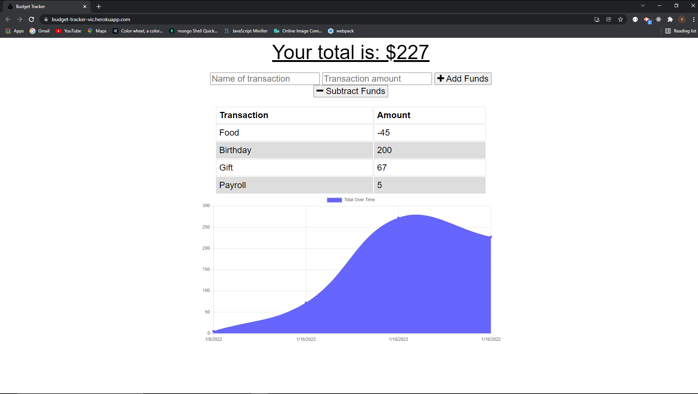

# Budget Tracker 

[Budget Tracker](https://budget-tracker-vic.herokuapp.com/)

## Application Description
This is a budgeting application that that can be installed on your desktop or device. The data is saved when offline and the app is updated as soon as an internet connection has been established.

## Table of Contents
* [Description](#application-description)
* [Installation](#installation)
* [Usage](#usage)
* [License](#license)
* [Contributions](#contributions)
* [Testing](#testing)
* [Questions](#questions)

## Installation
Use npm install to install packages.
Install your version of the application from your browser window.

## Usage
Free to use.

## License
N/A

## Contributions
You can contribute by creating a new issue.

## Testing
N/A

## Questions
Please feel free to reach out with any questions or concerns. I can be reached at victorj500@gmail.com or on GitHub at github.com/vic-smith.

